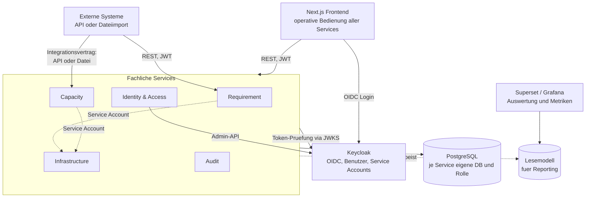

# Architekturüberblick

**Geltungsstand:** 2026-07-31, Meilenstein M0.

Dieses Dokument beschreibt das Zielbild der Plattform und den Weg dorthin. Die
verbindlichen fachlichen Anforderungen stehen in [`../../CLAUDE.md`](../../CLAUDE.md);
die Begründungen einzelner Festlegungen in [`../adr/`](../adr/README.md).

---

## 1. Zielbild

Die Plattform nimmt Projektanforderungen strukturiert auf, verwaltet sie über ihren
gesamten Lebenszyklus und verbindet sie mit der Kapazitäts- und Infrastrukturplanung des
Betreibers.

Zwei Zielgruppen mit unterschiedlichen Sichten auf dieselben Daten:

- **Anwender** erfassen und verfolgen Anforderungen und benötigen Transparenz über Status,
  Fortschritt und Entscheidungen.
- **Plattformbetreiber** benötigen eine Gesamtsicht, Kapazitätsplanung,
  Ressourcensteuerung und Prognosen künftiger Hardwarebedarfe.

Aus dieser Doppelrolle folgt die zentrale technische Eigenschaft der Plattform:
**dieselben Daten, unterschiedlich sichtbar und unterschiedlich änderbar, gesteuert über
ein feingranulares Berechtigungsmodell** (CLAUDE.md §8).

---

## 2. Tragende Architekturmerkmale

Vier Eigenschaften prägen den Entwurf stärker als alles andere. Sie sind die Merkmale,
an denen sich jede Entwurfsentscheidung messen lassen muss.

### Konfigurierbarkeit ohne Neuausrollung

Anforderungsattribute (§6), Workflows (§7), Bereitstellungskategorien (§17), Service-Typen
und Overhead-Modelle (§18) sind **Fachdaten, nicht Code**. Sie werden über
Administrationsoberflächen gepflegt und zur Laufzeit ausgewertet.

Konsequenz für den Entwurf: Validierung erfolgt gegen zur Laufzeit geladene Definitionen
(JSON Schema), nicht gegen zur Bauzeit festgelegte Typen. Zustandsübergänge werden aus
gespeicherten Zustandsgraphen abgeleitet, nicht aus `switch`-Anweisungen.

### Versionierung von Definitionen **und** von Daten

**Definitionen:** Attributdefinitionen, Workflow-Definitionen und Overhead-Modelle sind
versioniert. Eine laufende Anforderung bleibt auf der Version, unter der sie begonnen
wurde (§7); Änderungen am Overhead-Modell wirken ausschließlich auf neue Bestellungen
(§18). Jedes Fachobjekt führt einen Verweis auf die Definitionsversion mit, gegen die es
zu bewerten ist.

**Daten:** Jede Änderung erzeugt eine neue, vollständige Version
([ADR-0012](../adr/0012-vollstaendige-versionierung-mit-zeitbezug.md)). Der Zustand zu
einem beliebigen vergangenen Zeitpunkt ist als gewöhnliche Abfrage rekonstruierbar.

Der Zweck ist nicht Protokollierung, sondern **Nachweisfähigkeit**: belegen zu können,
welchen Anforderungsbestand das System zu einem bestimmten Zeitpunkt kannte – und damit,
dass die Kapazitätsplanung auf dieser Grundlage angemessen reagiert hat. Ein
Änderungsprotokoll beantwortet das nicht; es belegt, *dass* geändert wurde, nicht *wie die
Lage damals aussah*.

Konsequenzen: Die Historie ist zugleich der Auditpfad aus §16 – es entstehen nicht zwei
Mechanismen. Löschungen sind fachlich, nicht physisch. Und daraus folgt ein Zielkonflikt
mit Löschpflichten, der vor dem Produktivgang aufzulösen ist (`PROD-020`).

### Lückenlose Nachvollziehbarkeit

Jede Schreiboperation – aus der Oberfläche, über die API oder durch einen Service Account
– wird historisiert und auditiert, einschließlich Herkunft sowie altem und neuem Wert
(§16).

Konsequenz: Der Audit-Schreibpfad ist Bestandteil des Schreibvorgangs, kein
nachgelagerter Nebeneffekt. Er wird an einer Stelle je Service umgesetzt
(NestJS-Interceptor), nicht in jedem Handler.

### Austauschbarkeit an der Grenze zwischen Aufnahme und Berechnung

Anforderungsaufnahme und Kapazitätsberechnung müssen **unabhängig voneinander
funktionieren und einzeln durch Fremdsysteme ersetzbar sein**
([ADR-0010](../adr/0010-entkopplung-anforderung-und-kapazitaet.md)).

Das ist mehr als lose Kopplung. Konsequenzen für den Entwurf:

- Die Grenze ist ein **Integrationsvertrag**, kein interner Aufruf – versioniert und
  dokumentiert wie eine öffentliche Schnittstelle (§12).
- **Zwei gleichwertige Eingangswege**: API und Dateiimport, beide über denselben
  Verarbeitungspfad. Der Dateiimport ist eine Transportform, keine zweite
  Implementierung.
- **Keine gemeinsamen Bezeichner.** Datensätze werden über
  `(source_system, external_id)` identifiziert, nicht über interne Schlüssel.
- **Eigenes Statusvokabular im Vertrag.** Die Workflow-Zustände aus §7 sind
  konfigurierbare Fachdaten und würden den Vertrag bei der ersten Workflow-Anpassung
  brechen.

### Identität für Menschen und Maschinen

Service-zu-Service-Aufrufe laufen über dedizierte Service Accounts mit eigenen, minimal
notwendigen Rechten und eigener Auditspur (§4). Kein gemeinsamer technischer Account.

Konsequenz: Autorisierung wird nicht zwischen „Benutzeraufruf" und „interner Aufruf"
unterschieden. Es gibt nur Identitäten mit Rechten.

---

## 3. Systemüberblick

Durchgezogene Linien sind Aufrufe im Namen eines Benutzers oder externen Systems,
gestrichelte Linien Service-zu-Service-Verkehr über Service Accounts.

### Wie die Oberfläche daran hängt

Das Frontend bedient **alle** fachlichen Services, nicht nur den Requirement Service –
Stammdaten der Infrastruktur, Bestellungen, Szenarien der Kapazitätsplanung,
Rollenverwaltung. Ein Frontend, direkter Zugriff auf die jeweilige Service-API, je Service
eine eigene Zielgruppe im Token
([ADR-0013](../adr/0013-frontend-zuschnitt-und-zugriffsweg.md)).

**Bedienung und Auswertung sind getrennt.** Prognosekurven, Durchlaufzeiten und Ad-hoc-
Berichte entstehen nicht im Frontend, sondern in einem Auswertungswerkzeug gegen das
Lesemodell aus §10. Technische Infrastrukturmetriken laufen davon getrennt über Grafana
(§11). Auswertungswerkzeuge greifen **nie** direkt auf die Fachdatenbanken zu – sonst
wäre die Datenhoheit aus [ADR-0003](../adr/0003-datenbank-und-datenhoheit.md) umgangen
und jede Schemaänderung bräche Berichte.

**Wichtig:** Das Diagramm zeigt das Zielbild. Zum aktuellen Stand existiert ausschließlich
der Requirement Service. Zur Reihenfolge siehe Abschnitt 5 und
[ADR-0007](../adr/0007-inkrementeller-aufbau-der-servicelandschaft.md).

---

## 4. Technische Grundlagen

| Ebene | Festlegung | Begründung |
|---|---|---|
| Frontend | TypeScript, React, Next.js | CLAUDE.md §3 |
| Backend | TypeScript, NestJS (Fastify) | [ADR-0001](../adr/0001-backend-sprache-und-framework.md) |
| Forecasting | Python-Worker im Capacity Service | [ADR-0001](../adr/0001-backend-sprache-und-framework.md) |
| Datenhaltung | PostgreSQL, je Service eigene Datenbank und Rolle | [ADR-0003](../adr/0003-datenbank-und-datenhoheit.md) |
| Identität | Keycloak, OIDC, Client Credentials für Service Accounts | [ADR-0004](../adr/0004-authentifizierung-und-autorisierung.md) |
| Schnittstellen | REST, OpenAPI 3.1, Versionierung über den Pfad | [ADR-0005](../adr/0005-api-first-workflow.md) |
| Repository | Monorepo, pnpm Workspaces | [ADR-0002](../adr/0002-repository-struktur.md) |

Sämtliche Bestandteile stehen unter Open-Source-Lizenzen (CLAUDE.md §1).

---

## 5. Umsetzungsstrategie

Die Servicegrenzen gelten ab dem ersten Commit vollständig; die Services entstehen
nacheinander. Die Begründung steht in
[ADR-0007](../adr/0007-inkrementeller-aufbau-der-servicelandschaft.md).

| Meilenstein | Inhalt | Stand |
|---|---|---|
| **M0** | Fundament: Monorepo, lokale Infrastruktur, CI, Entscheidungen als ADRs | abgeschlossen |
| **M1** | Walking Skeleton Requirement Service: Kernentität, Authentifizierung, Persistenz, Versionshistorie, OpenAPI-Contract | abgeschlossen |
| **M2** | Frontend-Durchstich: Anmeldung, Liste, Anlegen, generierter API-Client | abgeschlossen |
| **M3** | Dynamisches Attributmodell (§6) und Datenhoheit (§19.3) | abgeschlossen |
| **M4** | Workflow-Engine (§7) | abgeschlossen |
| **M5** | Feingranulares Berechtigungsmodell (§8) im Requirement Service | abgeschlossen |
| **M6** | Identity & Access Service als eigener Dienst (§5) – Mandanten, Service Accounts, Rollenverwaltung | offen |
| **M7** | Infrastructure Service, Bereitstellungskategorien und Service-Katalog (§17, §18) | offen |
| **M8** | Capacity Service, Overhead-Berechnung und Forecasting (§9, §18) | offen |
| **M9** | Audit Service als eigenständiger Dienst, Reporting (§10), Visualisierung (§11) | offen |

### M1 im Detail

| | Inhalt | Beweist | Stand |
|---|---|---|---|
| **M1.1** | Service-Gerüst, Test-Harness, `GET /health` | Anwendung startet, Tests laufen lokal und in CI | abgeschlossen |
| **M1.2** | Authentifizierung: Guard gegen Keycloak-JWKS | Ohne Token 401, mit gültigem Token 200 | abgeschlossen |
| **M1.3** | Persistenz: Drizzle, Migration, Kernentität, Testcontainers | Echte Daten aus echtem PostgreSQL | abgeschlossen |
| **M1.4** | Schreibpfad, Versionshistorie, Stichtagsabfrage, OpenAPI-Contract mit drei Toren | Nachweisfähigkeit nach §19.4, Auditierung ab der ersten Schreiboperation | abgeschlossen |

Ergebnis: 31 Tests gegen Testcontainer, 2 gegen die echte lokale Infrastruktur, ein
versionierter Contract unter `docs/api/`.

### M2 im Detail

| | Inhalt | Beweist | Stand |
|---|---|---|---|
| **M2.1** | Realm-Client `frontend` von öffentlich auf vertraulich, Geheimnis über Variablenersetzung | Kein Geheimnis im Repository ([ADR-0014](../adr/0014-frontend-authentifizierung-ueber-bff.md) Punkt 6) | abgeschlossen |
| **M2.2** | Next.js als Arbeitsbereichspaket | Build und Typecheck laufen über die bestehende CI | abgeschlossen |
| **M2.3** | Serverseitige Anmeldung, Authorization Code Flow mit PKCE, versiegeltes Sitzungscookie | Kein Token im Browser ([ADR-0014](../adr/0014-frontend-authentifizierung-ueber-bff.md)) | abgeschlossen |
| **M2.4** | Weiterleitung der Browser-Aufrufe über Next, Tokenerneuerung, Typen aus dem Contract | Durchstich bis in die Datenbank: 201 beim Anlegen, 401 ohne Sitzung | abgeschlossen |
| **M2.5** | Oberfläche: Anforderungen auflisten und anlegen | Der fachliche Weg ist über alle Schichten begehbar | abgeschlossen |

Ergebnis: Mantine als Komponentengrundlage ([ADR-0016](../adr/0016-ui-grundlage-und-datenzugriff-im-frontend.md)),
9 Frontend-Tests, und ein Sitzungscookie, dessen Größe von einem Test überwacht wird
(`PROD-045`).

**Aus M2 sind sieben Einträge in die Produktionsreife gekommen** – `PROD-042` bis
`PROD-048`. Keiner davon ist ein Umsetzungsfehler; es sind die benannten Kehrseiten der
Entscheidungen ADR-0014 bis ADR-0016.

### M3 im Detail

M3 setzt §6 um – das dynamische Attributmodell – und damit zugleich die Datenhoheit aus
§19.3. Die tragenden Entscheidungen sind vorab getroffen:
[ADR-0011](../adr/0011-datenhoheit-je-feld-und-kontext.md) und
[ADR-0017](../adr/0017-regelvokabular-der-datenhoheit-und-mandantenbegriff.md).

| | Inhalt | Beweist | Stand |
|---|---|---|---|
| **M3.1** | Herkunftssysteme als Stammdaten, mit Merkmal *automatisch* oder *manuell* | Die Quellenklasse einer Schreiboperation ist bestimmbar (ADR-0017 A4) | abgeschlossen |
| **M3.2** | Attributdefinitionen als versionierte Fachdaten | Ein Attribut entsteht ohne Redeploy; ältere Definitionen bleiben auswertbar | abgeschlossen |
| **M3.3** | Laufzeitvalidierung dynamischer Attribute gegen die gültige Definition | Alle drei Eingangswege aus §19.2 durchlaufen **einen** Prüfpfad | abgeschlossen |
| **M3.4a** | Aktualisierung über den fremden Bezeichner, versioniert; fehlendes Feld heißt unverändert | Wiederholte Übermittlung erzeugt keine Dublette und keinen Konflikt (§19.1) | abgeschlossen |
| **M3.4b** | Hoheitsregeln als versionierte Fachdaten (ADR-0017 A1–A7) | Eine Regel entsteht ohne Redeploy | abgeschlossen |
| **M3.4c** | Durchsetzung im Schreibpfad, Aufzeichnung abgewiesener Schreiboperationen (ADR-0017 A2, B10) | Die Regel wirkt, und eine Abweisung ist belegbar | abgeschlossen |
| **M3.4d** | Festhaltung je Datensatz und Feld, Aufhebung (ADR-0017 B6–B13) | Der Einzelfall ist regelbar, ohne den Regelfall zu ändern | abgeschlossen |
| **M3.5** | Formulare zur Laufzeit aus dem Schema | Eine neue Pflichtangabe erscheint im Formular, ohne dass jemand eine Komponente anfasst | abgeschlossen |
| **M3.6** | Administrationsoberfläche: Definitionen, Regeln, Übersicht festgehaltener Felder | Die Konfigurationsfläche ist ohne Kenntnis des Datenmodells bedienbar (ADR-0017 B14) | abgeschlossen |

**Zur Reihenfolge.** M3.1 ist der kleinste Schritt des Meilensteins und blockiert alle
übrigen: Ohne die Registratur lässt sich nicht entscheiden, ob eine Schreiboperation
automatisch oder manuell ist, und damit greift keine einzige Hoheitsregel. Genau deshalb
steht er vorn und nicht „nebenbei" – als Nebensache erledigt, wird aus der Unterscheidung
eine freie Zeichenkette, die niemand pflegt.

**M3.4 wurde bei der Ausarbeitung geteilt.** Dabei zeigte sich, dass die Hoheitsregeln
nichts hatten, worauf sie wirken konnten: Der Service kannte für Anforderungen nur
Anlegen. Eine wiederholte Übermittlung endete mit `409` – und damit stellte sich die
Frage „wer gewinnt" nie. Der Aktualisierungspfad (M3.4a) ist deshalb die Voraussetzung
für die drei folgenden Schritte und zugleich die Erfüllung der Idempotenzforderung aus
§19.1. Aus derselben Betrachtung entstand
[ADR-0018](../adr/0018-vollstaendigkeit-und-loeschung-an-der-importgrenze.md).

M3.5 vor M3.6, weil das Formular aus dem Schema der eigentliche Nachweis für §6 ist. M3.6
ist umfangreicher, aber es verwaltet nur, was M3.2 bis M3.4 bereits können.

**Zum Umfang.** M3 ist deutlich größer als M2, und M3.2 bis M3.4 sind der fachlich
schwierigste Teil der Plattform.
[ADR-0007](../adr/0007-inkrementeller-aufbau-der-servicelandschaft.md) hat sie aus diesem
Grund bewusst spät eingeordnet: Sie brauchen ein belastbares Fundament, sonst werden sie
zweimal gebaut.

### M4 im Detail

M4 setzt §7 um – konfigurierbare Workflows als Zustandsgraph.

| | Inhalt | Beweist | Stand |
|---|---|---|---|
| **M4.1** | Workflow-Definition als versionierte Fachdaten: Zustände und Übergänge | Ein Zustand entsteht ohne Redeploy | abgeschlossen |
| **M4.2** | Statuswechsel über einen eigenen Vorgang statt über das Feld `status` | Jeder Wechsel wird gegen den Zustandsgraphen geprüft | abgeschlossen |
| **M4.3** | Bedingungen an Übergängen: Pflichtfelder, benötigte Berechtigung | Ein Übergang kann verlangen, was §7 nennt | abgeschlossen |
| **M4.4** | Umgang mit der gebundenen Fassung: Sichtbarkeit, Heben, Außerkraftsetzung | Eine Änderung der Definition wirkt nicht rückwirkend (§7) | abgeschlossen |
| **M4.5** | Oberfläche für den Erfasser: zulässige Übergänge als Schaltflächen statt eines freien Statusfeldes | Die Zustände kommen aus den Daten, nicht aus dem Code | abgeschlossen |
| **M4.6** | Oberfläche für den Administrator: Workflows und Verwaltungsvorgänge | §7 verlangt Konfiguration statt Redeploy – ohne sie bleibt „konfigurierbar" eine Behauptung | abgeschlossen |
| **M4.7** | Oberfläche für Bedingungen an Übergängen | Auch die Genehmigungsstrecke ist ohne Auslieferung änderbar | abgeschlossen |

**M4.2 war der unbequeme Schritt** und die erste **inkompatible Änderung mit echter
Verhaltensänderung**: Anders als bei den Contract-Korrekturen aus M3 verhält sich der
Dienst danach tatsächlich anders. `status` ist kein Feld im Rumpf mehr, sondern ein
eigener Vorgang gegen den Graphen; der Anfangszustand kommt aus der Definition, und ohne
gültigen Workflow entsteht keine Anforderung. Die Entscheidungen dahinter stehen in
[ADR-0022](../adr/0022-statuswechsel-als-eigener-vorgang.md), die Neubindung beim
Typwechsel in [ADR-0023](../adr/0023-workflow-bindung-beim-typwechsel.md).

**M4.2 hat einen Teil von M4.4 mitgenommen.** Eine Anforderung wird beim Anlegen an eine
Workflow-Fassung gebunden, und jeder Wechsel liest diese Fassung – nicht den aktuellen
Workflow. Die Bindung erst später zu lesen hätte bedeutet, dass M4.4 das Verhalten
bestehender Anforderungen noch einmal ändert, ohne dass sich an ihnen etwas geändert hätte.

**Ein Punkt aus dem ursprünglichen M4.4-Zuschnitt hat sich beim Nachsehen aufgelöst:** „was
gilt, wenn die gebundene Fassung den Zustand nicht mehr führt" kann aus der Bindung heraus
nicht entstehen – Historienzeilen werden nie geändert. Der Fall tritt nur beim Wechsel der
Anforderungsart auf, und dafür gibt es seit M4.2 die Meldung und den Zuordnungsvorgang.
Geblieben und umgesetzt sind Sichtbarkeit der Bindung, das Heben auf die aktuelle Fassung
und die Bedeutung der Außerkraftsetzung ([ADR-0025](../adr/0025-umgang-mit-der-gebundenen-workflow-fassung.md)).

**`PROD-052` bleibt bis M4.3 offen.** Der Graph erzwingt seit M4.2 die Reihenfolge, aber
nicht die Zuständigkeit – wer einen Übergang nehmen darf, wird nicht geprüft. Ein Ablauf,
der das eine tut und das andere nicht, sieht aus wie eine Genehmigungsstrecke und ist
keine.

**M4.6 kam beim Zuschnitt von M4.3 dazu.** Der Plan hatte für Workflows keine
Verwaltungsoberfläche – M4.5 ist die Sicht des Erfassers. Konfiguriert wird bis dahin durch
Zusammenstellen von JSON gegen die API, und damit ist §7 nicht erfüllt: „ohne Redeploy
änderbar" heißt nicht „von Hand im Editor". Die Reihenfolge ist trotzdem M4.3 vor M4.6 –
dieselbe wie in M3, wo die Oberfläche (M3.6) erst entstand, als das Datenmodell vollständig
war. Andernfalls wird sie zweimal gebaut.

**M4.4 ist der Gegensatz zu §6 und muss es sein.** Attributdefinitionen werden gegen die
*aktuell gültige* Fassung geprüft (M3.3); Workflow-Definitionen gelten für eine laufende
Anforderung in der Fassung, unter der sie gestartet ist. Der Unterschied ist beabsichtigt:
Ein nachträglich geänderter Zustandsgraph würde sonst Anforderungen in Zustände versetzen,
die es zu ihrer Zeit nicht gab.

**Die seit [ADR-0001](../adr/0001-backend-sprache-und-framework.md) vertagte Wahl der
Regel-Engine** fällt in M4.3 – nicht früher. Ob es überhaupt eine braucht, zeigt sich erst
an den tatsächlich benötigten Bedingungen.

### M5 im Detail

M5 setzt §8 um – RBAC als Basis, ABAC für Objekt-, Feld- und Aktionsebene.

**Der Meilenstein wurde geteilt.** Er hieß ursprünglich „Berechtigungsmodell **und**
Identity & Access Service". Das sind zwei Vorhaben: §8 lässt sich im Requirement Service
umsetzen, mit einer Policy-Engine daneben. Ein zweiter Dienst zieht dagegen sofort den
Messaging-Backbone nach (Kafka gegen NATS), mTLS zwischen Diensten, eine zweite Datenbank
und einen zweiten Contract – Infrastrukturarbeit, die mit §8 wenig zu tun hat. Sie ist
jetzt M6; die übrigen Meilensteine rücken um eins.

| | Inhalt | Beweist | Stand |
|---|---|---|---|
| **M5.1** | Der wirksame Mandant: Begriff, Herkunft, Zuschnitt am Datensatz | Eine Abfrage weiß, in wessen Namen sie läuft | abgeschlossen |
| **M5.2** | Policy-Engine: Wahl, Anbindung, Regeln als versionierte Artefakte | Eine Berechtigung ist prüfbar und auditierbar, nicht verstreut | abgeschlossen ([ADR-0028](../adr/0028-policy-engine-opa-als-sidecar.md)) |
| **M5.3** | Objektbezug, soweit die Daten ihn hergeben: Mandant und Eigentümer. Die Engine übernimmt den Lesezuschnitt | Die Engine wirkt (`PROD-059`); Zuschnitt am Objekt statt nur am Mandanten | abgeschlossen ([ADR-0029](../adr/0029-zuschnitt-der-zustaendigkeit.md)); der direkte Zugriff folgte mit M5.4 (`PROD-060`) |
| **M5.4** | Feldebene (§6, §8); dazu die Vertretung durch eine Gruppe und die Verengung des direkten Zugriffs (`PROD-060`) | Ein Feld ist für den einen sichtbar und für den anderen nicht; eine Anforderung hängt nicht an einer einzigen Person | abgeschlossen ([ADR-0030](../adr/0030-feldebene-und-vertretung.md)) |
| **M5.5** | Attributdatentyp „Person"; dazu der Identitätsvergleich, der ihn erst wirksam macht | `identitaet` aus ADR-0024 wird benutzbar | abgeschlossen ([ADR-0031](../adr/0031-personenfelder-und-identitaetsvergleich.md)) |

**M5.1 umfasst auch die Stufung der Konfiguration** ([ADR-0026](../adr/0026-wirksamer-mandant-und-stufung-der-konfiguration.md)
Punkt 4 und 5): Attributdefinitionen, Hoheitsregeln und Workflows tragen einen Mandanten,
und je Schlüssel gilt die spezifischste Definition. Die Auswahl liegt in
`src/gemeinsam/spezifitaet.ts` – an einer Stelle, weil drei Bereiche sie brauchen.

Der Zuschnitt am Datensatz hängt an genau zwei Stellen: `ausHerkunft` und `ausKennung` in
`requirements.service.ts` sind die einzigen Punkte, an denen ein Datensatz nachgeschlagen
wird. Beide prüfen die Zugehörigkeit und antworten für einen fremden Mandanten mit **404,
nicht 403** – dass ein Datensatz existiert, ist selbst eine Auskunft.

**Die zweite Stufe war lange nur lesbar** (`PROD-056`): Weder die Verwaltungsoberfläche noch
die Anlege- und Änderungs-DTOs der drei Konfigurationsobjekte reichten einen Mandanten
durch; mandantenspezifische Definitionen entstanden ausschließlich per direktem SQL, wie es
die Testhelfer tun. Mit M5.4 erledigt – die Zusicherung aus ADR-0026 Punkt 4 gilt seither
für das Schreiben wie für das Lesen.

**M5.2 – was vor der Umsetzung geprüft wurde.**
[ADR-0028](../adr/0028-policy-engine-opa-als-sidecar.md) macht die partielle Auswertung zur
Grundlage gefilterter Listen. Ob sie im **Upstream**-OPA verfügbar ist oder nur im
kommerziellen Enterprise OPA, war offen – und Open Source First ist harte Anforderung ohne
Ausnahme für Kernkomponenten. Geprüft am 2026-08-13 gegen `openpolicyagent/opa:1.19.0`
(Abbildmarkierung `org.opencontainers.image.source` verweist auf `open-policy-agent/opa`,
Lizenz Apache-2.0):

| Frage | Befund |
|---|---|
| Partielle Auswertung im Upstream | ja – `opa eval --partial` liefert `input.requirement.tenant in ["t-eins", "t-zwei"]` |
| Bedingung aus der Compile-API | ja – `POST /v1/compile/requirements/include` |
| SQL-Zieldialekt | `{"query":"WHERE requirement.tenant IN (E't-eins', E't-zwei')"}` |
| UCAST-Zieldialekt | `{"field":"requirement.tenant","operator":"in","type":"field","value":["t-eins","t-zwei"]}` |

**Das Zielformat ist UCAST, nicht SQL** – und das ist eine Festlegung, keine Geschmacksfrage.
Die SQL-Variante liefert eine Zeichenkette mit **eingesetzten Werten**. Sie zu benutzen
hieße, erzeugtes SQL in eine Abfrage einzusetzen und die Maskierung der Engine als
Schutzmaßnahme zu übernehmen – die Parameterbindung von Drizzle entfiele genau dort, wo
Werte aus einem Token stammen. UCAST liefert stattdessen eine Struktur, aus der sich eine
**parametrisierte** Bedingung bauen lässt. Wer das später zur SQL-Variante vereinfacht,
tauscht eine gebundene Abfrage gegen eine zusammengesetzte.

Folge für den Zuschnitt: Ein Übersetzer vom Rego-Syntaxbaum ist **nicht** nötig. Es bleibt
eine kleine Abbildung von UCAST auf Drizzle-Bedingungen, begrenzt auf die Vergleichsformen,
die unsere Richtlinien tatsächlich benutzen.

**Der Antwortvertrag der Compile-API – die gefährlichste Stelle der Anbindung.** Die
Teilauswertung kennt drei Ergebnisse, und **alle drei kommen mit HTTP 200**:

| Fall | Antwort | Bedeutung |
|---|---|---|
| Bedingung | `{"result":{"query":{"field":…,"operator":…,"value":…}}}` | Filter anwenden |
| Unbedingtes Ja | `{"result":{"query":{}}}` | kein Filter, alles sichtbar |
| Unbedingtes **Nein** | `{}` | nichts sichtbar |

Die beiden entgegengesetzten Bedeutungen unterscheiden sich allein dadurch, **ob `result`
vorhanden ist**. Ein Client, der `result?.query` liest und bei `undefined` „kein Filter"
annimmt, liefert bei unbedingtem Nein den gesamten Bestand.

Dieselbe Falle ein zweites Mal, anders verkleidet: Bei einem Anwender **ohne jede
Zugehörigkeit** fehlt die Bedingung nicht – sie kommt als leere Menge,
`{"operator":"in","value":[]}`. Wer leere Wertelisten als „nichts zu filtern" überspringt,
öffnet denselben Bestand. Es gibt also **zwei Schreibweisen für „nichts"** und eine für
„alles", und keine davon ist am Statuscode zu erkennen.

Beide Fälle gehören in die Tests der Anbindung, bevor die erste Zeile Filterlogik
entsteht. Erhoben am 2026-08-13 gegen OPA 1.19.0.

**Was M5.2 belegt hat.** `test/berechtigung.integration.spec.ts` vergleicht die aus der
Richtlinie erzeugte Bedingung gegen `GET /v1/requirements` – also gegen das ausgelieferte
Verhalten und nicht gegen eine nachgebaute Abfrage. Beide Seiten lösen den leeren Fall
verschieden (Kurzschluss im Repository, `false` im Übersetzer), und genau deshalb sagt die
Übereinstimmung etwas aus. Damit ist die tragende Annahme aus ADR-0028 kein Zutrauen mehr,
sondern ein Testlauf.

**Der Zuschnitt der Übersetzung ist absichtlich eng.** `ucast.ts` kennt ein Feld und einen
Vergleich; alles andere wirft. Die Regel dahinter: **Eine Übersetzung, die im Zweifel
nichts hinzufügt, öffnet den Bestand.** Ein Fehler ist sichtbar, eine weggelassene
Bedingung nicht. Deshalb ist die Feldliste ausgeschrieben und kein Nachschlagen über den
Spaltennamen.

Was nach M5.2 **nicht** gilt: dass die Engine wirkt. Der Lesezuschnitt läuft weiter über
den SQL-Filter aus M5.1; die Engine ist angebunden und unbenutzt (`PROD-059`).

**M5.1 steht am Anfang und nicht M5.2.** Der Mandantenbegriff bestimmt mit, was die Engine
auswerten muss – nicht umgekehrt. [ADR-0017](../adr/0017-regelvokabular-der-datenhoheit-und-mandantenbegriff.md)
Teil C hält fest, dass ein Anwender mehreren Mandanten angehören kann, und vertagt die
Auflösung ausdrücklich. Ohne sie ist „Mandantenzuschnitt" nicht umsetzbar.

**M5.4 berührt §12 unmittelbar.** Wenn ein Aufrufer manche Felder nicht sehen darf, fehlen
sie in der Antwort – ein Vertrag, der sie als Pflichtfelder ausweist, wäre dann falsch. Die
Frage, wie Feldebene und Contract zusammengehen, fällt dort und nicht früher.

### Warum diese Reihenfolge

**M1 vor allem anderen**, weil der vertikale Durchstich sämtliche Querschnittsfragen
einmal an einem echten Beispiel beantwortet: Migrationen, Integrationstests gegen eine
echte Datenbank, Token-Validierung, Audit-Schreibpfad, Container-Build, CI. Bei parallel
begonnenen Services würde jede dieser Fragen mehrfach und uneinheitlich beantwortet.

**Requirement Service vor Identity & Access Service**, weil Authentifizierung,
Benutzerverwaltung und Service Accounts von Keycloak bereits ab M0 bereitgestellt werden.
Der eigene Service wird erst gebraucht, wenn Berechtigungen über Rollen im Token
hinausgehen.

**Dynamische Attribute (M3) und Berechtigungsmodell (M5) bewusst spät**, weil sie die
fachlich schwierigsten Teile sind. Sie benötigen ein belastbares Fundament, sonst werden
sie zweimal gebaut. Das Datenmodell aus M1 darf sie jedoch nicht ausschließen – die
Kernentität trägt das dynamische Attributfeld von Beginn an, auch wenn zunächst nichts
darin validiert wird.

---

## 6. Querschnittsthemen

### Authentifizierung und Autorisierung

Ab dem **ersten** Endpunkt aktiv, nicht ab einem späteren Meilenstein (Security by
Design, §2). Grobgranulare Prüfung aus Token-Ansprüchen; die Prüfung auf Objekt- und
Feldebene folgt in M5 über eine Policy-Engine. Bis dahin liegen sämtliche
Berechtigungsprüfungen ausschließlich in NestJS-Guards, damit sie später an einer Stelle
austauschbar sind.

### Auditierung

Einheitliches Audit-Ereignisschema ab M1. Bis zur Herauslösung des Audit Service in M8
schreibt jeder Service seine Ereignisse in die eigene Datenbank. Die spätere Herauslösung
überträgt damit Daten und Schreibpfad, statt das Konzept nachträglich zu erfinden.

### Beobachtbarkeit

OpenTelemetry ab M1, auch solange nur ein Dienst existiert. Ablaufverfolgung
nachzurüsten, wenn bereits mehrere Dienste miteinander sprechen, ist deutlich aufwendiger
als sie von Beginn an mitzuführen.

### Fehlerformat

RFC 9457 (`application/problem+json`), einheitlich über alle Services
([ADR-0005](../adr/0005-api-first-workflow.md)).

---

## 7. Bewusst offene Punkte

Diese Fragen sind erkannt und absichtlich noch nicht beantwortet. Die vollständige Liste
mit Zeitpunkten steht in [`../adr/README.md`](../adr/README.md#offene-bewusst-vertagte-entscheidungen).

- ORM und Migrationswerkzeug (M1)
- Policy-Engine für die Feldebene (M5)
- Regel-Engine für Workflow-Übergänge (M4)
- Messaging-Backbone zwischen Services (sobald der zweite Service existiert)
- Reporting-Lesemodell: eigenes Modell oder vorgefertigte Lösung wie Metabase (M8)

---

## 8. Weiterführend

- Verantwortlichkeiten und Datenhoheit je Service: [`services.md`](services.md)
- Aufbau und Durchsetzung konfigurierbarer Abläufe (§7): [`workflows.md`](workflows.md)
- Einrichtung der Entwicklungsumgebung: [`../development/installation.md`](../development/installation.md)
- Werkzeugkette und Konventionen: [`../development/tooling.md`](../development/tooling.md)
