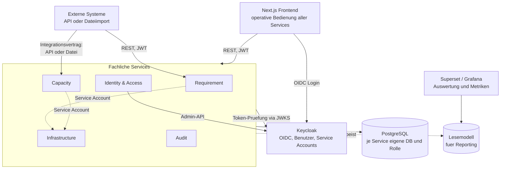

# Architekturüberblick

**Geltungsstand:** 2026-07-31, Meilenstein M0.

Dieses Dokument beschreibt das Zielbild der Plattform und den Weg dorthin. Die
verbindlichen fachlichen Anforderungen stehen in [`../../CLAUDE.md`](../../CLAUDE.md);
die Begründungen einzelner Festlegungen in [`../adr/`](../adr/README.md).

---

## 1. Zielbild

Die Plattform nimmt Projektanforderungen strukturiert auf, verwaltet sie über ihren
gesamten Lebenszyklus und verbindet sie mit der Kapazitäts- und Infrastrukturplanung des
Betreibers.

Zwei Zielgruppen mit unterschiedlichen Sichten auf dieselben Daten:

- **Anwender** erfassen und verfolgen Anforderungen und benötigen Transparenz über Status,
  Fortschritt und Entscheidungen.
- **Plattformbetreiber** benötigen eine Gesamtsicht, Kapazitätsplanung,
  Ressourcensteuerung und Prognosen künftiger Hardwarebedarfe.

Aus dieser Doppelrolle folgt die zentrale technische Eigenschaft der Plattform:
**dieselben Daten, unterschiedlich sichtbar und unterschiedlich änderbar, gesteuert über
ein feingranulares Berechtigungsmodell** (CLAUDE.md §8).

---

## 2. Tragende Architekturmerkmale

Vier Eigenschaften prägen den Entwurf stärker als alles andere. Sie sind die Merkmale,
an denen sich jede Entwurfsentscheidung messen lassen muss.

### Konfigurierbarkeit ohne Neuausrollung

Anforderungsattribute (§6), Workflows (§7), Bereitstellungskategorien (§17), Service-Typen
und Overhead-Modelle (§18) sind **Fachdaten, nicht Code**. Sie werden über
Administrationsoberflächen gepflegt und zur Laufzeit ausgewertet.

Konsequenz für den Entwurf: Validierung erfolgt gegen zur Laufzeit geladene Definitionen
(JSON Schema), nicht gegen zur Bauzeit festgelegte Typen. Zustandsübergänge werden aus
gespeicherten Zustandsgraphen abgeleitet, nicht aus `switch`-Anweisungen.

### Versionierung von Definitionen **und** von Daten

**Definitionen:** Attributdefinitionen, Workflow-Definitionen und Overhead-Modelle sind
versioniert. Eine laufende Anforderung bleibt auf der Version, unter der sie begonnen
wurde (§7); Änderungen am Overhead-Modell wirken ausschließlich auf neue Bestellungen
(§18). Jedes Fachobjekt führt einen Verweis auf die Definitionsversion mit, gegen die es
zu bewerten ist.

**Daten:** Jede Änderung erzeugt eine neue, vollständige Version
([ADR-0012](../adr/0012-vollstaendige-versionierung-mit-zeitbezug.md)). Der Zustand zu
einem beliebigen vergangenen Zeitpunkt ist als gewöhnliche Abfrage rekonstruierbar.

Der Zweck ist nicht Protokollierung, sondern **Nachweisfähigkeit**: belegen zu können,
welchen Anforderungsbestand das System zu einem bestimmten Zeitpunkt kannte – und damit,
dass die Kapazitätsplanung auf dieser Grundlage angemessen reagiert hat. Ein
Änderungsprotokoll beantwortet das nicht; es belegt, *dass* geändert wurde, nicht *wie die
Lage damals aussah*.

Konsequenzen: Die Historie ist zugleich der Auditpfad aus §16 – es entstehen nicht zwei
Mechanismen. Löschungen sind fachlich, nicht physisch. Und daraus folgt ein Zielkonflikt
mit Löschpflichten, der vor dem Produktivgang aufzulösen ist (`PROD-020`).

### Lückenlose Nachvollziehbarkeit

Jede Schreiboperation – aus der Oberfläche, über die API oder durch einen Service Account
– wird historisiert und auditiert, einschließlich Herkunft sowie altem und neuem Wert
(§16).

Konsequenz: Der Audit-Schreibpfad ist Bestandteil des Schreibvorgangs, kein
nachgelagerter Nebeneffekt. Er wird an einer Stelle je Service umgesetzt
(NestJS-Interceptor), nicht in jedem Handler.

### Austauschbarkeit an der Grenze zwischen Aufnahme und Berechnung

Anforderungsaufnahme und Kapazitätsberechnung müssen **unabhängig voneinander
funktionieren und einzeln durch Fremdsysteme ersetzbar sein**
([ADR-0010](../adr/0010-entkopplung-anforderung-und-kapazitaet.md)).

Das ist mehr als lose Kopplung. Konsequenzen für den Entwurf:

- Die Grenze ist ein **Integrationsvertrag**, kein interner Aufruf – versioniert und
  dokumentiert wie eine öffentliche Schnittstelle (§12).
- **Zwei gleichwertige Eingangswege**: API und Dateiimport, beide über denselben
  Verarbeitungspfad. Der Dateiimport ist eine Transportform, keine zweite
  Implementierung.
- **Keine gemeinsamen Bezeichner.** Datensätze werden über
  `(source_system, external_id)` identifiziert, nicht über interne Schlüssel.
- **Eigenes Statusvokabular im Vertrag.** Die Workflow-Zustände aus §7 sind
  konfigurierbare Fachdaten und würden den Vertrag bei der ersten Workflow-Anpassung
  brechen.

### Identität für Menschen und Maschinen

Service-zu-Service-Aufrufe laufen über dedizierte Service Accounts mit eigenen, minimal
notwendigen Rechten und eigener Auditspur (§4). Kein gemeinsamer technischer Account.

Konsequenz: Autorisierung wird nicht zwischen „Benutzeraufruf" und „interner Aufruf"
unterschieden. Es gibt nur Identitäten mit Rechten.

---

## 3. Systemüberblick

Durchgezogene Linien sind Aufrufe im Namen eines Benutzers oder externen Systems,
gestrichelte Linien Service-zu-Service-Verkehr über Service Accounts.

### Wie die Oberfläche daran hängt

Das Frontend bedient **alle** fachlichen Services, nicht nur den Requirement Service –
Stammdaten der Infrastruktur, Bestellungen, Szenarien der Kapazitätsplanung,
Rollenverwaltung. Ein Frontend, direkter Zugriff auf die jeweilige Service-API, je Service
eine eigene Zielgruppe im Token
([ADR-0013](../adr/0013-frontend-zuschnitt-und-zugriffsweg.md)).

**Bedienung und Auswertung sind getrennt.** Prognosekurven, Durchlaufzeiten und Ad-hoc-
Berichte entstehen nicht im Frontend, sondern in einem Auswertungswerkzeug gegen das
Lesemodell aus §10. Technische Infrastrukturmetriken laufen davon getrennt über Grafana
(§11). Auswertungswerkzeuge greifen **nie** direkt auf die Fachdatenbanken zu – sonst
wäre die Datenhoheit aus [ADR-0003](../adr/0003-datenbank-und-datenhoheit.md) umgangen
und jede Schemaänderung bräche Berichte.

**Wichtig:** Das Diagramm zeigt das Zielbild. Zum aktuellen Stand existiert ausschließlich
der Requirement Service. Zur Reihenfolge siehe Abschnitt 5 und
[ADR-0007](../adr/0007-inkrementeller-aufbau-der-servicelandschaft.md).

---

## 4. Technische Grundlagen

| Ebene | Festlegung | Begründung |
|---|---|---|
| Frontend | TypeScript, React, Next.js | CLAUDE.md §3 |
| Backend | TypeScript, NestJS (Fastify) | [ADR-0001](../adr/0001-backend-sprache-und-framework.md) |
| Forecasting | Python-Worker im Capacity Service | [ADR-0001](../adr/0001-backend-sprache-und-framework.md) |
| Datenhaltung | PostgreSQL, je Service eigene Datenbank und Rolle | [ADR-0003](../adr/0003-datenbank-und-datenhoheit.md) |
| Identität | Keycloak, OIDC, Client Credentials für Service Accounts | [ADR-0004](../adr/0004-authentifizierung-und-autorisierung.md) |
| Schnittstellen | REST, OpenAPI 3.1, Versionierung über den Pfad | [ADR-0005](../adr/0005-api-first-workflow.md) |
| Repository | Monorepo, pnpm Workspaces | [ADR-0002](../adr/0002-repository-struktur.md) |

Sämtliche Bestandteile stehen unter Open-Source-Lizenzen (CLAUDE.md §1).

---

## 5. Umsetzungsstrategie

Die Servicegrenzen gelten ab dem ersten Commit vollständig; die Services entstehen
nacheinander. Die Begründung steht in
[ADR-0007](../adr/0007-inkrementeller-aufbau-der-servicelandschaft.md).

| Meilenstein | Inhalt | Stand |
|---|---|---|
| **M0** | Fundament: Monorepo, lokale Infrastruktur, CI, Entscheidungen als ADRs | abgeschlossen |
| **M1** | Walking Skeleton Requirement Service: Kernentität, Authentifizierung, Persistenz, Versionshistorie, OpenAPI-Contract | abgeschlossen |
| **M2** | Frontend-Durchstich: Anmeldung, Liste, Anlegen, generierter API-Client | offen |
| **M3** | Dynamisches Attributmodell (§6) | offen |
| **M4** | Workflow-Engine (§7) | offen |
| **M5** | Feingranulares Berechtigungsmodell (§8), Identity & Access Service | offen |
| **M6** | Infrastructure Service, Bereitstellungskategorien und Service-Katalog (§17, §18) | offen |
| **M7** | Capacity Service, Overhead-Berechnung und Forecasting (§9, §18) | offen |
| **M8** | Audit Service als eigenständiger Dienst, Reporting (§10), Visualisierung (§11) | offen |

### M1 im Detail

| | Inhalt | Beweist | Stand |
|---|---|---|---|
| **M1.1** | Service-Gerüst, Test-Harness, `GET /health` | Anwendung startet, Tests laufen lokal und in CI | abgeschlossen |
| **M1.2** | Authentifizierung: Guard gegen Keycloak-JWKS | Ohne Token 401, mit gültigem Token 200 | abgeschlossen |
| **M1.3** | Persistenz: Drizzle, Migration, Kernentität, Testcontainers | Echte Daten aus echtem PostgreSQL | abgeschlossen |
| **M1.4** | Schreibpfad, Versionshistorie, Stichtagsabfrage, OpenAPI-Contract mit drei Toren | Nachweisfähigkeit nach §19.4, Auditierung ab der ersten Schreiboperation | abgeschlossen |

Ergebnis: 31 Tests gegen Testcontainer, 2 gegen die echte lokale Infrastruktur, ein
versionierter Contract unter `docs/api/`.

### Warum diese Reihenfolge

**M1 vor allem anderen**, weil der vertikale Durchstich sämtliche Querschnittsfragen
einmal an einem echten Beispiel beantwortet: Migrationen, Integrationstests gegen eine
echte Datenbank, Token-Validierung, Audit-Schreibpfad, Container-Build, CI. Bei parallel
begonnenen Services würde jede dieser Fragen mehrfach und uneinheitlich beantwortet.

**Requirement Service vor Identity & Access Service**, weil Authentifizierung,
Benutzerverwaltung und Service Accounts von Keycloak bereits ab M0 bereitgestellt werden.
Der eigene Service wird erst gebraucht, wenn Berechtigungen über Rollen im Token
hinausgehen.

**Dynamische Attribute (M3) und Berechtigungsmodell (M5) bewusst spät**, weil sie die
fachlich schwierigsten Teile sind. Sie benötigen ein belastbares Fundament, sonst werden
sie zweimal gebaut. Das Datenmodell aus M1 darf sie jedoch nicht ausschließen – die
Kernentität trägt das dynamische Attributfeld von Beginn an, auch wenn zunächst nichts
darin validiert wird.

---

## 6. Querschnittsthemen

### Authentifizierung und Autorisierung

Ab dem **ersten** Endpunkt aktiv, nicht ab einem späteren Meilenstein (Security by
Design, §2). Grobgranulare Prüfung aus Token-Ansprüchen; die Prüfung auf Objekt- und
Feldebene folgt in M5 über eine Policy-Engine. Bis dahin liegen sämtliche
Berechtigungsprüfungen ausschließlich in NestJS-Guards, damit sie später an einer Stelle
austauschbar sind.

### Auditierung

Einheitliches Audit-Ereignisschema ab M1. Bis zur Herauslösung des Audit Service in M8
schreibt jeder Service seine Ereignisse in die eigene Datenbank. Die spätere Herauslösung
überträgt damit Daten und Schreibpfad, statt das Konzept nachträglich zu erfinden.

### Beobachtbarkeit

OpenTelemetry ab M1, auch solange nur ein Dienst existiert. Ablaufverfolgung
nachzurüsten, wenn bereits mehrere Dienste miteinander sprechen, ist deutlich aufwendiger
als sie von Beginn an mitzuführen.

### Fehlerformat

RFC 9457 (`application/problem+json`), einheitlich über alle Services
([ADR-0005](../adr/0005-api-first-workflow.md)).

---

## 7. Bewusst offene Punkte

Diese Fragen sind erkannt und absichtlich noch nicht beantwortet. Die vollständige Liste
mit Zeitpunkten steht in [`../adr/README.md`](../adr/README.md#offene-bewusst-vertagte-entscheidungen).

- ORM und Migrationswerkzeug (M1)
- Policy-Engine für die Feldebene (M5)
- Regel-Engine für Workflow-Übergänge (M4)
- Messaging-Backbone zwischen Services (sobald der zweite Service existiert)
- Reporting-Lesemodell: eigenes Modell oder vorgefertigte Lösung wie Metabase (M8)

---

## 8. Weiterführend

- Verantwortlichkeiten und Datenhoheit je Service: [`services.md`](services.md)
- Einrichtung der Entwicklungsumgebung: [`../development/installation.md`](../development/installation.md)
- Werkzeugkette und Konventionen: [`../development/tooling.md`](../development/tooling.md)
